# Skills & Agents Architecture

Color key:
- Blue — reference files
- Green — skills with a connected agent
- Yellow — skills with no agent (standalone, invoked directly by users)
- Purple — agents

```mermaid
graph BT
    classDef ref fill:#dbeafe,stroke:#3b82f6,color:#1e40af
    classDef skill fill:#dcfce7,stroke:#16a34a,color:#14532d
    classDef skillOnly fill:#fef9c3,stroke:#ca8a04,color:#713f12
    classDef agent fill:#f3e8ff,stroke:#9333ea,color:#3b0764

    subgraph refs["Reference Files"]
        direction LR
        r_gb["gear-basics"]:::ref
        r_gm["gear-metadata"]:::ref
        r_gu["gear-utils"]:::ref
        r_gmf["gear-manifest"]:::ref
        r_sb["sdk-basics"]:::ref
        r_sdo["sdk-data-operations"]:::ref
        r_ssq["sdk-search-query"]:::ref
        r_sgj["sdk-gears-jobs"]:::ref
        r_sc["sdk-collections"]:::ref
        r_spu["sdk-permissions-users"]:::ref
        r_sdv["sdk-data-views"]:::ref
        r_sar["sdk-audit-reporting"]:::ref
        r_srs["sdk-reader-studies"]:::ref
        r_spg["product-guide"]:::ref
        r_core["core_* endpoints (48)"]:::ref
        r_xfer["xfer_* + snapshot (10)"]:::ref
        r_mr["create-mr"]:::ref
    end

    subgraph skills["Skills"]
        direction LR
        s_fg["fw-gear"]:::skill
        s_fc["fw-client"]:::skill
        s_sdk["flywheel-sdk"]:::skill
        s_cw["code_writer"]:::skill
        s_cr["code_reviewer"]:::skill
        s_ca["code_architect"]:::skill
        s_car["code_architect_reviewer"]:::skill
        s_cp["change_planner"]:::skill
        s_dbg["debugger"]:::skill
        s_dw["doc_writer"]:::skill
        s_tw["test_writer"]:::skill
        s_pa["process_architect"]:::skill
        s_bv["bootstrap_validator"]:::skillOnly
        s_wc["write_claudemd"]:::skillOnly
        s_gl["gitlab"]:::skillOnly
        s_jira["jira-comment"]:::skillOnly
        s_sm["skill_maker"]:::skillOnly
    end

    subgraph agents["Agents"]
        direction LR
        a_cw["code_writer"]:::agent
        a_cr["code_reviewer"]:::agent
        a_ca["code_architect"]:::agent
        a_car["code_architect_reviewer"]:::agent
        a_cp["change_planner"]:::agent
        a_dbg["debugger"]:::agent
        a_dw["doc_writer"]:::agent
        a_tw["test_writer"]:::agent
        a_pa["process_architect"]:::agent
        a_pm["pm"]:::agent
        a_ow["omni_writer"]:::agent
    end

    %% refs → skills
    r_gb --> s_fg
    r_gm --> s_fg
    r_gu --> s_fg
    r_gmf --> s_fg
    r_sb --> s_sdk
    r_sdo --> s_sdk
    r_ssq --> s_sdk
    r_sgj --> s_sdk
    r_sc --> s_sdk
    r_spu --> s_sdk
    r_sdv --> s_sdk
    r_sar --> s_sdk
    r_srs --> s_sdk
    r_spg --> s_sdk
    r_core --> s_fc
    r_xfer --> s_fc
    r_mr --> s_gl

    %% skills → agents
    s_fg --> a_cw
    s_fc --> a_cw
    s_sdk --> a_cw
    s_cw --> a_cw
    s_cr --> a_cr
    s_ca --> a_ca
    s_car --> a_car
    s_cp --> a_cp
    s_dbg --> a_dbg
    s_dw --> a_dw
    s_tw --> a_tw
    s_pa --> a_pa
```

